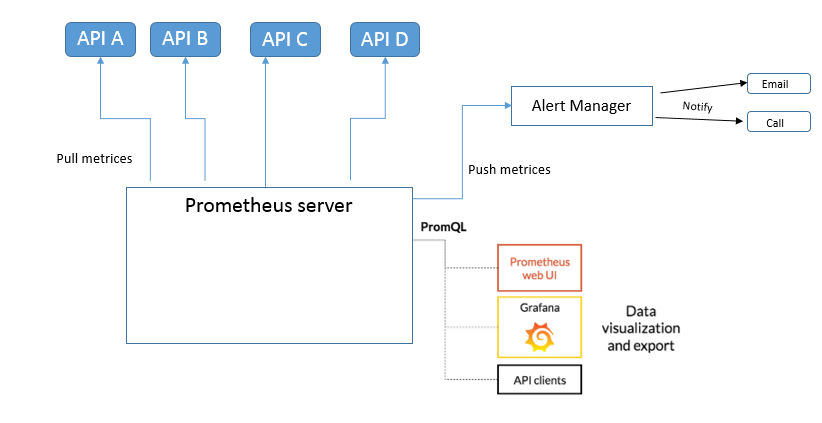

# Spring Boot 2 + Micrometer

### Enabling Prometheus in application

1. Create Spring Boot initiazer (https://start.spring.io/) project from Spring with Spring MVC and Actuator 
2. Add dependency for micrometer
3. Enable prometheus properties 
4. Add @Timed annotation around your API 
5. Once you start application you can see the metrices available at http://localhost:8091/actuator/prometheus
6. On the Prometheus server side, each target is scraped at a regular interval(scrape interval). Each scrape reads the metrics to get the current state of the client metrics, and persists the values in the Prometheus time-series database

### Monitoring the metrices in dashboard
docker-compose up
This will start 4 spring boot services, Prometheus and Grafana and then you can see metrices against call made to API are available  in grafana.

References:
1.  https://dzone.com/articles/using-micrometer-with-spring-boot-2
2.  Undestading you metrices: 
    - https://pierrevincent.github.io/2017/12/prometheus-blog-series-part-2-metric-types/
    - https://prometheus.io/docs/practices/naming/
3. https://micrometer.io/docs
    
 
